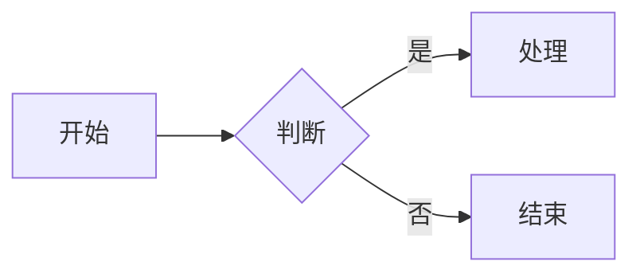
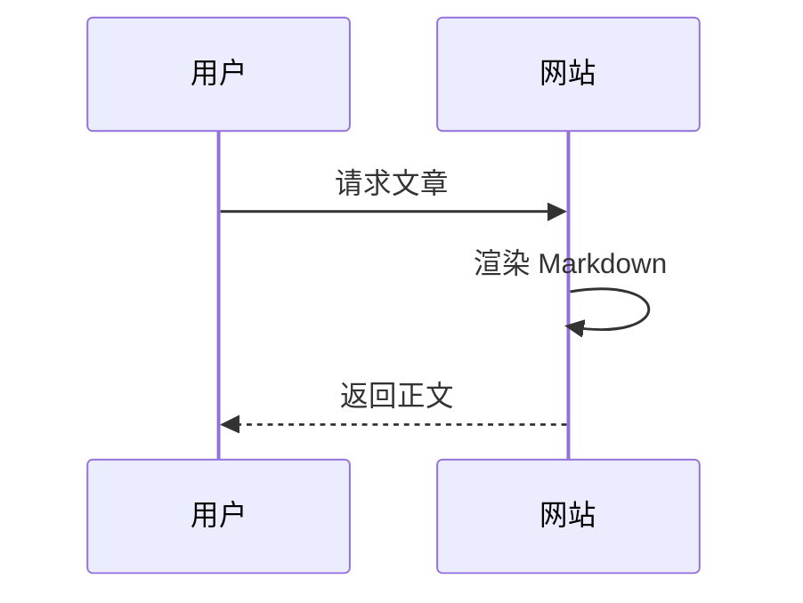
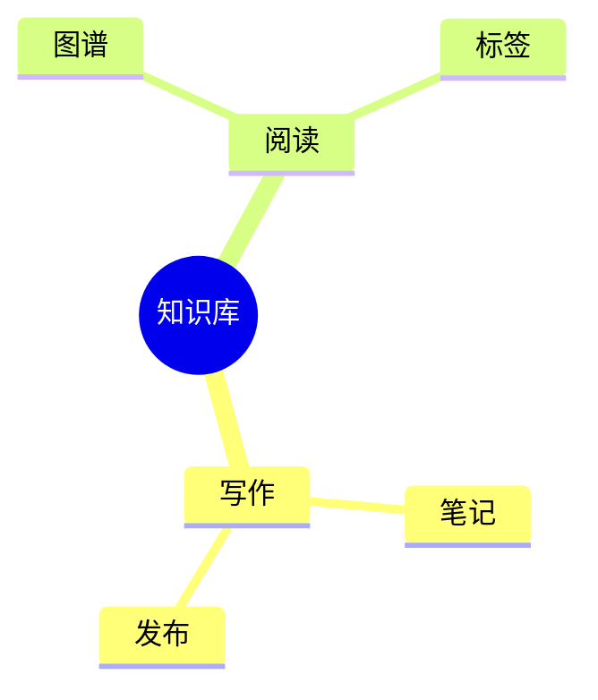
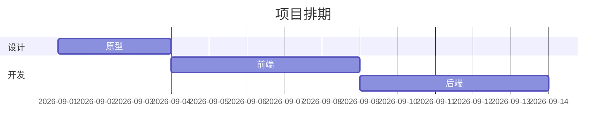

##  Vault整体目录结构
```
vault
├─ Attachments         # 媒体附件仓库：图片、视频、pdf等资源
│    ├─ png.png
│    └─ mp4.mp4
├─ BrainPress          # 正式业务笔记，网站最终只输出此目录内容
└─ Compositions        # 格式样例陈列库【本文件夹】
     ├─ canvas.canvas  # Obsidian Canvas画布文件
     ├─ excalidraw.md  # Excalidraw绘图文件
     └─ pdf.pdf        # PDF测试文件
```

## 1. YAML元数据（笔记头部）
```yaml
---
aliases: ["别名1","别名2"]
tags: ["标签A","标签B"]
created: 2026‑08‑25
updated: 2026‑08‑25
status: 草稿
---
```

## 2. 标题
# H1 一级标题
## H2 二级标题
### H3 三级标题
#### H4 四级标题
##### H5 五级标题
###### H6 六级标题

## 3. 文本格式
*斜体文字*
_斜体文字_
**粗体文字**
__粗体文字__
***粗斜体文字***
~~删除线文字~~
==Obsidian高亮文字==
`行内代码片段`

## 4. 列表
### 无序列表
- 条目一
  - 嵌套子条目
    - 深层嵌套
- 条目二

### 有序列表
1. 第一条
2. 第二条
   1. 嵌套子项
3. 第三条

### 任务列表
- [ ] 未完成任务
- [x] 已经完成任务
- [ ] 待测试canvas渲染

## 5. 引用块
> 一级引用，可以混入**粗体**、`代码`、==高亮==
>> 二级嵌套引用
>>> 三级嵌套引用

## 6. 代码块
```php
<?php
// BrainPress php示例
echo "渲染markdown";
```

```bash
sudo apt update
```

```javascript
function hello(){
    console.log("js代码");
}
```

## 7. 表格
|模块|技术|状态|
|----|----|----|
|Markdown渲染|PHP|✅完成|
|Canvas解析|待开发|⏳计划|

|左对齐|居中|右对齐|
|:---|:---:|---:|
|A| B | C|

## 8. 分割线
---
***

## 9. 链接
普通外部链接：[文字](https://example.com)
裸链接：<https://example.com>

> 注意：外部网络链接延后开发，优先本地资源

## 10. Obsidian本地资源嵌入（本项目重点测试）
![[png.png]]
![[mp4.mp4]]
![[Multipage.pdf]]
![[Canvas.canvas]]
## 11. Callout提示块
> [!note] 普通说明
> 普通提示信息

> [!warning] ⚠️警告
> 重要风险提醒

> [!tip] 💡小提示
> 优化建议

> [!danger] 高危
> 不要把Compositions目录生成对外网页

> [!info]- 折叠块（默认收起）
> 点击箭头展开内容

## 12. 数学公式
行内公式：$E=mc^2$

$$
F = ma
$$

## 13. 注释（预览隐藏）
%%单行隐藏注释，编辑模式可见%%

%%
多行注释
预览完全看不到
%%

## 14. 脚注
正文内容[^note1]
[^note1]:脚注的解释文字

## 15. 标签
#markdown #brainpress/test #格式样例

## 16. 块ID
一段带标记的文字  ^block
 ![[MarkDown*^block]]
## 17. Mermaid 图表（BrainPress 渲染扩展）

> Mermaid 是 BrainPress 原生内置的图表功能：在笔记里用 ```` ```mermaid ```` 代码块写图，打开笔记时自动渲染成图形（非代码高亮）。

### 流程图（graph）


### 时序图（sequence）


### 思维导图（mindmap）


### 甘特图（gantt）


> 该代码块不参与代码高亮、不加行号；Mermaid 库在页面出现 mermaid 块时才按需加载。
